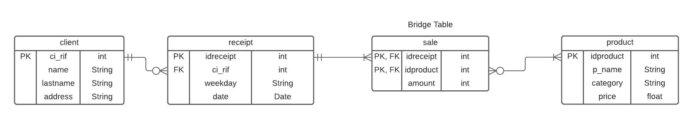

# Minería de datos - Reglas de asociación

Asignación #1, para la materia de Minería de datos.

## Modelado de datos 

## Como ejecutar

Primero que todo instalar las dependencias haciendo `npm install`.

Este proyecto contiene dos dependencias:

1. `pg`: cliente de PostgreSQL para Node.js
2. `lodash`: dependencia con utilidades como *comparación de arrays*

Luego que se instalan las dependencias se procede a ejecutar el programa haciendo `npm start`.

## Conocimiento adquirido

- Mejor manejo de Node.js
- Entendimiento del algoritmo apriori y su importancia
- Mayor destreza en JavaScript